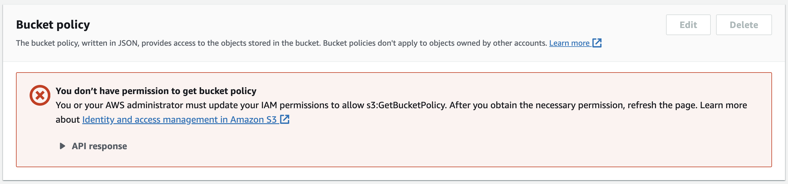

# LAB 4: S3 ACCESS CONTROL
Authors : Valzino Benjamin, Urizar Pablo
### TASK 1: ACCESSING THE CONSOLE AS AN IAM USER
**2. Open the Amazon EC2 console. Choose EC2 Dashboard. Many API Error messages display. This is expected.**
<div style="text-align:left;">
  
</div>

<br>  
<br>  
<br>  
<br>  
<br>  
<br>  

**3. Attempt some actions in the Amazon EC2 console :**
<div style="text-align:left;">
  
</div>

A message displays "You are not authorized to perform this operation" as expected.

**4. To explore what you can access in the Amazon S3 console, open it :**
<div style="text-align:left;">
  
</div>

The `Access` column displays the message "Insufficient permissions" for all the three buckets as expected.

### TASK 2: ANALYZING THE IDENTITY-BASED POLICY APPLIED TO THE IAM USER
Review the IAM policy details.
<div style="text-align:left;">
  
</div>

<br>  

DeveloperGroupPolicy:
```json
{
    "Version": "2012-10-17",
    "Statement": [
        {
            "Action": [
                "cloudformation:Describe*",
                "cloudformation:Get*",
                "cloudformation:List*",
                "iam:Describe*",
                "iam:GetAccountAuthorizationDetails",
                "iam:GetGroup",
                "iam:GetGroupPolicy",
                "iam:GetPolicy",
                "iam:GetPolicyVersion",
                "iam:GetRole",
                "iam:GetRolePolicy",
                "iam:GetUser",
                "iam:GetUserPolicy",
                "iam:List*",
                "logs:Desc*",
                "logs:Get*",
                "logs:List*",
                "s3:CreateBucket",
                "s3:ListAllMyBuckets",
                "s3:ListBucket",
                "s3:PutAccountPublicAccessBlock",
                "s3:PutBucketOwnershipControls",
                "s3:PutBucketPublicAccessBlock",
                "sts:AssumeRole"
            ],
            "Resource": "*",
            "Effect": "Allow"
        }
    ]
}
```

Here is what we can state in the `DeveloperGroupPolicy` given :
- There isn't anything related to EC2
- The `iam:GetAccountSummary` is not present in the policy
- There are no object-related actions granted to S3 (GetObject, PutObject, DeleteObject, etc.)

### TASK 3: ATTEMPTING WRITE-LEVEL ACCESS TO AWS SERVICES
**1. Attempt to create an S3 bucket :**
<div style="text-align:left;">
  
</div>

**2. Access the bucket and attempt to upload an object. A message displays `Upload failed` as expected :**
<div style="text-align:left;">
  
</div>

**3. Review the policy details for Amazon S3 access :**

We were able to create the S3 bucket thanks to the S3 permission `s3:CreateBucket`. We can also list the S3 buckets
created thanks to `s3:ListAllMyBuckets`. Finally, we can list the content of a bucket with `s3:ListBucket`.

The permission that is missing in our policy for us to be able to upload objects to the bucket is `s3:PutObject`.
Additionally, we could also add `s3:GetObject` to allow us to retrieve an object from un S3 bucket. Since they were
not explicity allowed they are denied by default. 

### TASK 4: ASSUMING AN IAM ROLE AND REVIEWING A RESOURCE-BASED POLICY
**1. Try to download an object from the buckets that were created during lab setup :**
<div style="text-align:left;">
  
</div>

**2. Assume the BucketsAccessRole IAM role in the console :**
<div style="text-align:left;">
  
</div>

**3. Try to download an object from Amazon S3 again :**

As expected, we were able to download the image since the S3 permission `s3:GetObject` on `bucket1` is allowed.
<div style="text-align:left;">
  
</div>

**4. Test IAM access with the BucketsAccessRole :**

As expected, an error message displays that we no longer have permissions to view the IAM user groups page because
BucketsAccessRole does not have the iam:ListGroups action applied to it.
<div style="text-align:left;">
  
</div>

`AccessDenied` error page appears as expected.

**5. Assume the devuser role again, and test access to the user groups page :**

Now that we unassumed the BucketsAccessRole, we have the permissions that are assigned to the devuser IAM user
(through this user's membership in the DeveloperGroup). We are able to view the user groups page again.
<div style="text-align:left;">
  
</div>

**6. Analyze the IAM policy that is associated with the BucketsAccessRole :**

`GrantBucket1Access` : the entity is allowed to retrieve an S3 Object (s3:GetObject) and list the contents of a S3
bucket (s3:ListBucket) on the bucket1 and its objects.

`ListAllBucketsPolicy` : the entity is allowed to list all the S3 buckets (s3:ListAllMyBuckets). The action is
allowed on all resources (*).

<div style="text-align:left;">
  
</div>

**7. Save a copy of the GrantBucket1Access policy to your computer**

**8. Complete your analysis of the BucketsAccessRole details :**

This IAM role trust policy allows the IAM users (devuser1, devuser2 and devuser3) in the AWS account that has the ID
058258612171 to assume the IAM role associated with this trust policy (sts:AssumeRole).

<div style="text-align:left;">
  
</div>

**9. Assume the BucketsAccessRole, and try to upload an image to bucket2 :**

We were able to upload the image to bucket2 since the user `devuser1` is able to assume the role `BucketsAccessRole`.
This role is allowed to download (s3:GetObject) and upload (s3:PutObject) objects to bucket2. There is a also a bucket
policy for `bucket2` that grants the `s3:PutObject` to bucket2 to `BucketsAccessRole` principal. 
<div style="text-align:left;">
  
</div>

### TASK 5: UNDERSTANDING RESOURCE-BASED POLICIES
**1. Observe the details of the bucket policy that is applied to bucket2 :**

In this bucket policy we allow the IAM role `BucketsAccessRole` to perform `s3:GetObject` and `s3:PutObject` actions
on objects within bucket2 and allow `s3:ListBucket` on the same bucket.

Bucket policy:
```json
{
    "Version": "2008-10-17",
    "Statement": [
        {
            "Sid": "S3Write",
            "Effect": "Allow",
            "Principal": {
                "AWS": "arn:aws:iam::058258612171:role/BucketsAccessRole"
            },
            "Action": [
                "s3:GetObject",
                "s3:PutObject"
            ],
            "Resource": "arn:aws:s3:::bucket2-cd834d37-7b45-475e-998a-63dc8a5a4020/*"
        },
        {
            "Sid": "ListBucket",
            "Effect": "Allow",
            "Principal": {
                "AWS": "arn:aws:iam::058258612171:role/BucketsAccessRole"
            },
            "Action": "s3:ListBucket",
            "Resource": "arn:aws:s3:::bucket2-cd834d37-7b45-475e-998a-63dc8a5a4020"
        }
    ]
}
```

### TASK 6: FIND A WAY TO UPLOAD AN OBJECT TO BUCKET3
**1. Try to upload the file as devuser with no role assumed :**
<div style="text-align:left;">
  
</div>

<div style="text-align:left;">
  
</div>


**2. Assume the BucketsAccessRole, and try the actions from the previous step :**
Bucket policy :
```json
{
    "Version": "2008-10-17",
    "Statement": [
        {
            "Sid": "S3Write",
            "Effect": "Allow",
            "Principal": {
                "AWS": "arn:aws:iam::058258612171:role/OtherBucketAccessRole"
            },
            "Action": [
                "s3:GetObject",
                "s3:PutObject"
            ],
            "Resource": "arn:aws:s3:::bucket3-cd668ce6-4839-4823-98df-be312db0038c/*"
        },
        {
            "Sid": "ListBucket",
            "Effect": "Allow",
            "Principal": {
                "AWS": "arn:aws:iam::058258612171:role/OtherBucketAccessRole"
            },
            "Action": "s3:ListBucket",
            "Resource": "arn:aws:s3:::bucket3-cd668ce6-4839-4823-98df-be312db0038c"
        }
    ]
}
```

We have all the information we need. We can use the account ID : `058258612171` and the role : `OtherBucketAccessRole`
to be able to upload the object to the S3 bucket `bucket3-cd668ce6-4839-4823-98df-be312db0038c` as follows :

<div style="text-align:left;">
  
</div>

### TASK 7: DESIGN AND IMPLEMENT PERMISSION POLICIES FOR S3
Create a bucket that at the top level has three folders for internal, private, and public data :

<div style="text-align:left;">
  
</div>

Create the following IAM roles :
- AcmeStaff role that has read access to internal and public data
- AcmeDataScientist role that has read and write access to all data
- AcmeDataIngester role that has write access to internal and private data

<div style="text-align:left;">
  
</div>

Create customer-managed policies and attach them to the roles :

<div style="text-align:left;">
  
</div>

Example for AcmeDataGrDStaff :
```json
{
    "Version": "2012-10-17",
    "Statement": [
        {
            "Effect": "Allow",
            "Action": "s3:GetObject",
            "Resource": "arn:aws:s3:::acmedata-grd/internal/*"
        },
        {
            "Effect": "Allow",
            "Action": "s3:GetObject",
            "Resource": "arn:aws:s3:::acmedata-grd/public/*"
        },
        {
            "Effect": "Deny",
            "Action": "s3:GetObject",
            "NotResource": [
                "arn:aws:s3:::acmedata-grd/internal/*",
                "arn:aws:s3:::acmedata-grd/public/*"
            ]
        }
    ]
}
```

`AcmeDataGrDStaff` policy attached to `AcmeGrDStaff` role :

<div style="text-align:left;">
  
</div>

To configure policies that allow anybody to have read access to the `public` folder in our S3 bucket we created the
bucket policy :

```json
{
  "Version": "2012-10-17",
  "Statement": [
    {
      "Effect": "Allow",
      "Principal": "*",
      "Action": "s3:ListBucket",
      "Resource": "arn:aws:s3:::acmedata-grd"
    },
    {
      "Effect": "Allow",
      "Principal": "*",
      "Action": "s3:GetObject",
      "Resource": "arn:aws:s3:::acmedata-grd/public/*"
    }
  ]
}
```

If we needed to grant read access to the public data only to the IAM roles we created previously, we could create a
customer managed policy `AcmeDataGrDFullReadAccess` and attach it to the 3 roles :
```json
{
  "Version": "2012-10-17",
  "Statement": [
    {
      "Effect": "Allow",
      "Action": "s3:ListBucket",
      "Resource": "arn:aws:s3:::acmedata-grd"
    },
    {
      "Effect": "Allow",
      "Action": "s3:GetObject",
      "Resource": "arn:aws:s3:::acmedata-grd/public/*"
    }
  ]
}
```